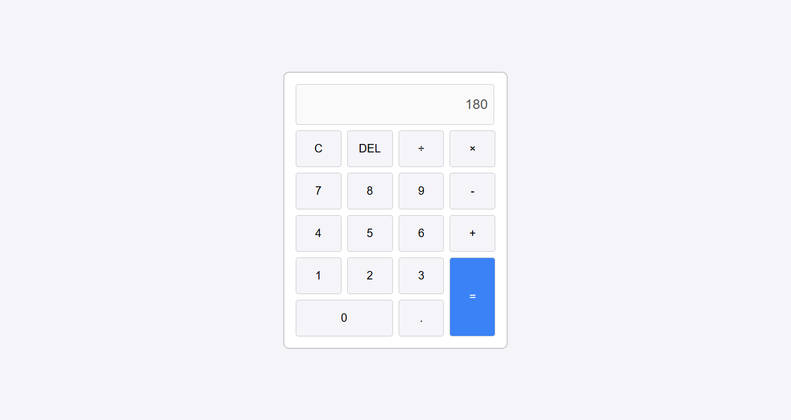

# Kalkulator prosty

Prosty kalkulator stworzony przy użyciu HTML, CSS i JavaScript. Pozwala na wykonywanie podstawowych działań matematycznych takich jak dodawanie, odejmowanie, mnożenie i dzielenie.

## Jak to działa?

Kalkulator działa w przeglądarce za pomocą pętli w javascript. Użytkownik wpisuje działania klikając przyciski, a po wciśnięciu `=` zostaje wyświetlony wynik zgodny z kolejnością wykonywania działań. Wpisywane działania są analizowane jako jedno wyrażenie (np. `2 + 3 * 4` zwróci `14`), dzięki czemu wynik jest poprawny zgodnie z zasadami matematyki.

## Zobacz demo

### Podgląd działania

### Link do testu
[Demo kalkulatora](https://rayskidev.github.io/kalkulator-js/)

## Środowisko testowe
- Opera GX
- Microsoft Edge
- Firefox
- Google Chrome
